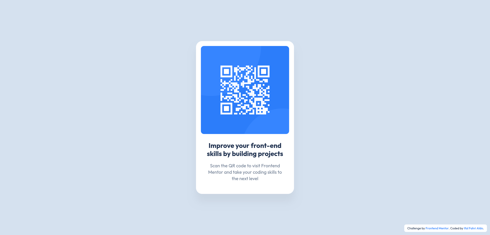

# Frontend Mentor - QR code component solution

This is a solution to the [QR code component challenge on Frontend Mentor](https://www.frontendmentor.io/challenges/qr-code-component-iux_sIO_H). Frontend Mentor challenges help you improve your coding skills by building realistic projects.

## Table of contents

- [Frontend Mentor - QR code component solution](#frontend-mentor---qr-code-component-solution)
  - [Table of contents](#table-of-contents)
  - [Overview](#overview)
    - [Screenshot](#screenshot)
    - [Links](#links)
  - [My process](#my-process)
    - [Built with](#built-with)
    - [What I learned](#what-i-learned)
    - [Continued development](#continued-development)
  - [Author](#author)

## Overview

### Screenshot

### Links

- Solution URL: [Github](https://github.com/ifalfahri/frontend-mentor-challenges/tree/main/01/qr-code-component)
- Live Site URL: [Github Pages](https://ifalfahri.github.io/frontend-mentor-challenges/01-qr-code-component)

## My process

### Built with

- HTML
- CSS

### What I learned

Through this project, I reinforced my understanding of:

- CSS variables
- Creating card component with shadows
- Responsive image handling within containers

### Continued development

In future projects, I'd like to focus on:

- Improving my CSS organization for larger projects
- Learning more about responsive design techniques
- Exploring CSS animations for interactive elements

## Author

- Website - [Ifal Fahri Aldo](https://ifal.me)
- Frontend Mentor - [@ifalfahri](https://www.frontendmentor.io/profile/ifalfahri)
